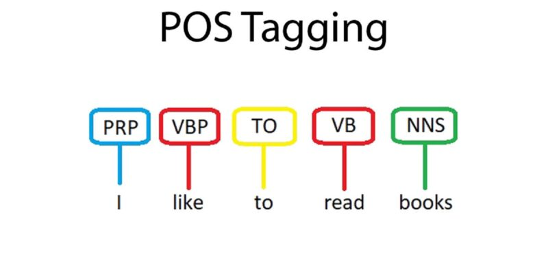

# POS-Tagging

## Table of Contents

- [Project](#POS-Tagging)
  - [Table of Contents](#table-of-contents)
  - [About The Project](#introduction)
  - [Demo](#demo)
  - [Documentation](#documentation)
  - [File Structure](#file-structure)
  - [Project Workflow](#project-workflow)
  - [Getting started](#Getting-Started)
  - [Acknowledgements and Resources](#acknowledgements-and-references)
  - [License](#license)

## Introduction

Part-Of-Speech (POS) tagging is the process of assigning a part-of-speech tag (Noun, Verb, Adjective, etc.) to each word in an input text. In other words, the main objective is to identify which grammatical category do each word in given test belong to.



POS Tagging is difficult because some words can represent more than one part of speech at different times, i.e. They are Ambiguous in nature. Consider the following example:

The whole team played <b>well</b>. ```adverb```

You are doing <b>well</b> for yourself. ```adjective```

<b>Well</b>, this is a lot of work. ```interjection```

The <b>well</b> is dry. ```noun```

Tears were beginning to <b>well</b> in her eyes. ```verb```

### Domains Explored

Machine Learning, Natural Language Processing, Dynamic Programming

## Demo

## Documentation

For Documentation, click <a href="/documentation/README.md">here</a> or refer ```/documentation/README.md```

## File Structure
```
👨‍💻POS-Tagging
 ┣ 📂assets                            // Contains all the reference gifs, images
 ┣ 📂components                        // Header Files
 ┃ ┣ 📄data.cpp
 ┃ ┣ 📄data.hpp
 ┃ ┣ 📄tokenize.cpp
 ┃ ┣ 📄tokenize.hpp
 ┃ ┣ 📄viterbi.cpp
 ┃ ┣ 📄viterbi.hpp
 ┣ 📂data                              // Dataset
 ┃ ┣ 📄dataset.pos
 ┃ ┣ 📄sample.pos
 ┃ ┣ 📄test.pos
 ┣ 📂documentation                     // Notes & Documentation for project
 ┃ ┣ 📄notes.pdf
 ┃ ┣ 📄README.md
 ┣ 📂Miscellaneous                     // .ipynb implementation
 ┃ ┣ 📄POS-Tagging-C2_W2_Assignment
 ┣ 📄main.cpp
 ┣ 📄README.md
``` 

## Project Workflow

## Getting Started

### Prerequisites
To download and use this code, the minimum requirements are:

* [g++](https://gcc.gnu.org/onlinedocs/gcc-3.3.6/gcc/G_002b_002b-and-GCC.html): The GNU C++ compiler, available as part of the GNU Compiler Collection (GCC) or Any C++ Compiler
* Windows 7 or later (64-bit), Any modern Linux distribution (e.g., Ubuntu, Debian, Fedora, Arch Linux)
* [Microsoft VS Code](https://code.visualstudio.com/download) or any other IDE 

### Installation

Clone the project by typing the following command in your Terminal/CommandPrompt

```
git clone https://github.com/PritK99/POS-Tagging.git
```
Navigate to the MazeBlaze-v2.1 folder

```
cd POS-Tagging
```

### Usage

Once the requirements are satisfied, you can easily build and run the project on your machine.
Use the following commands to 

* Build the code:

```
g++ .\main.cpp .\components\data.cpp .\components\tokenize.cpp .\components\viterbi.cpp
```

* Run the executable 

```
./a.out (For Linux)
```
or 
```
./a (For Windows)
```

## Acknowledgements and References

* [Natural Language Processing with Probabilistic Models](https://www.coursera.org/learn/probabilistic-models-in-nlp?specialization=natural-language-processing) by DeepLearning.AI
* [YouTube video](https://www.youtube.com/watch?v=kqSzLo9fenk) by Serrano.Academy explaining Hidden Markov Model and Viterbi Algorithm
 
## License
[MIT License](https://opensource.org/licenses/MIT)


