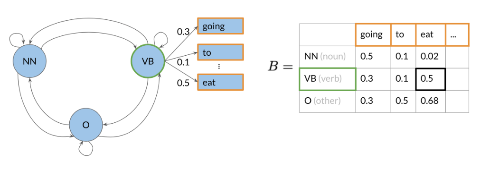
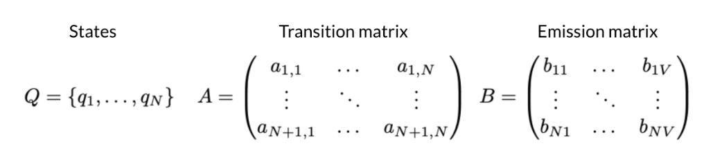
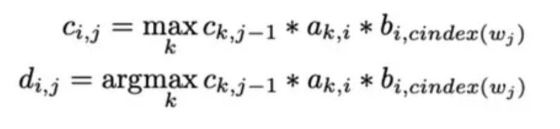
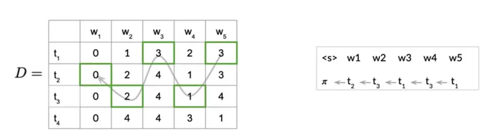

# POS-Tagging


## Introduction

<b>Part-Of-Speech (POS) tagging</b> is the process of assigning a part-of-speech tag (Noun, Verb, Adjective, etc.) to each word in an input text. In other words, the main objective is to identify which grammatical category do each word in given test belong to. POS Tagging is difficult because some words can represent more than one part of speech at different times, i.e. they are ambiguous in nature. Consider the following examples:

The whole team played <b>well</b>. ```adverb```

You are doing <b>well</b> for yourself. ```adjective```

<b>Well</b>, this is a lot of work. ```interjection```

The <b>well</b> is dry. ```noun```

Tears were beginning to <b>well</b> in her eyes. ```verb```

For all these statements, the same word ```well``` assumes different parts of speech. Hence, we use <b>Hidden Markov Model</b> which is a probabilistic model along with <b>Viterbi Algorithm</b> to assign parts of speech tags.

## Theory

### Hidden Markov Model

Hidden Markov model (HMM) is a statistical model that can be used to describe the evolution of observable events that depend on internal factors, which are not directly observable. We call the observed event a symbol and the invisible factor underlying the observation a state. An HMM consists of two stochastic processes, namely, an invisible process of hidden states and a visible process of observable symbols. The hidden states form a Markov chain, and the probability distribution of the observed symbol depends on the underlying state

### Viterbi Algorithm

The Viterbi algorithm is a dynamic programming algorithm used for decoding hidden Markov models (HMMs) and finding the most likely sequence of hidden states that generated a sequence of observations. The brute force method requires us to consider each possible state and hence is exponential in nature. Viterbi Algorithm, on the other hand, maintains the best of probabilities for all states it has seen in a tabular format. Hence it is much more efficient than brute force method.

For detailed theory, refer ```documentation/notes.pdf``` or [YouTube video](https://www.youtube.com/watch?v=kqSzLo9fenk) by Serrano.Academy explaining Hidden Markov Model and Viterbi Algorithm

## Implementation

### Phase I: Data Processing

The datasets used in this project are taken from Coursera course ```Natural Language Processing with Probabilistic Models``` and are stored in ```/data``` directory.

* ```dataset.pos``` will be used for training.
* ```test.pos``` will be used for testing.
* ```sample.pos``` will be used for debugging.

A few items of the training corpus list are shown below:

```['In\tIN\n', 'an\tDT\n', 'Oct.\tNNP\n', '19\tCD\n', 'review\tNN\n']```

Data Processing mainly involves use of ```/components/data.cpp```. The POS Tags and their description is available <a href="http://relearn.be/2015/training-common-sense/sources/software/pattern-2.6-critical-fork/docs/html/mbsp-tags.html">here</a>. We create pairs of (tag, word) by traversing through the dataset. Additionally, we introduce start tag, denoted by ```--s--```. This is used to calculate prior frequecy and prior probabilities, which are used in Hidden Markov Model.

Further, once we recieve input, we first tokenize it. Here we seperate all words and punctions. In addition to tokenization, we introduce ```UNK```, which stands for unknown symbols. All those words which are not available in vocabulary are marked as unknown.


### Phase II: Calculating Probabilities using Hidden Markov Model (HMM)

The idea behind HMMs are that we calculate two different types of probabilities, namely Transition Probability and Emission Probabilty. 



We use functions defined in ```tokenization.cpp``` to calculate frequencies of occurences of (tag, tag), (tag, word), (--s--, tag) and indivisual tags. This allows us to calculate transition probability, emission probability, prior probability. We use hash maps such as ```transition_freq``` to store the frequencies and ```transition_probs``` to store the probabilities.



Additionally, for pairs having frequency 0, we assign them a very small probability ```epsilon```. Also, while storing the probabilities, we first take log of these probabilities. This comes useful during use of Viterbi Algorithm, since multiplication of these small probabilities can lead to numeric underflow.

### Phase III: Choosing POS Tags using Viterbi Algorithm

The Viterbi Algorithm mainly comprises of 3 steps:

1. Initialization: Here we initialize auxilary matrices ```dp``` and ```path```. The first matrix is used to store the best values seen by adding the probabilities of sequence (since we are using log), and the other matrix allows us to reconstruct the path. We make use of prior probabilities to populate first column of ```dp``` matrix, while the first column of ```path``` is filled with 0.

2. Forward Pass: Here we populate matrix ```dp``` and accordingly fill ```path```.



3. Backward Pass: We use ```path``` matrix to reconstruct the optimal path, and hence generating sequence of POS Tags.



## Applications

Some applications of POS Tagging are as follows:

* Name Entity Recognition
* Q&A systems
* Word Sense Disambiguation
* Chatbots