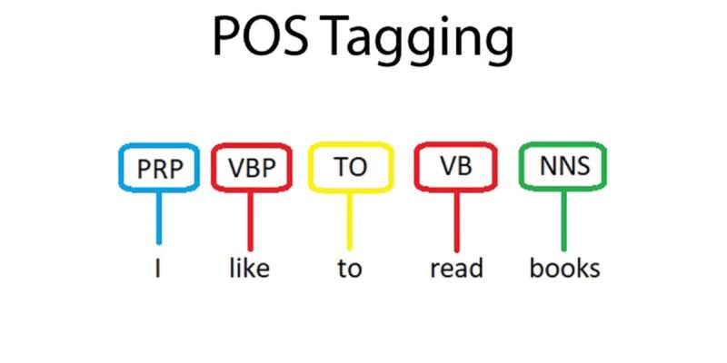

# POS-Tagging

## Introduction

Part-Of-Speech (POS) tagging is the process of assigning a part-of-speech tag (Noun, Verb, Adjective, etc.) to each word in an input text. In other words, the main objective is to identify which grammatical category do each word in given test belong to.



POS Tagging is difficult because some words can represent more than one part of speech at different times, i.e. They are Ambiguous in nature. Consider the following example:

The whole team played <b>well</b>. ```adverb```

You are doing <b>well</b> for yourself. ```adjective```

<b>Well</b>, this is a lot of work. ```interjection```

The <b>well</b> is dry. ```noun```

Tears were beginning to <b>well</b> in her eyes. ```verb```

## Theory

## Implementation

### Phase I: Data Processing

The datasets used in this project are taken from Coursera course ```Natural Language Processing with Probabilistic Models``` and are stored in ```/data``` directory.

* ```dataset.pos``` will be used for training.
* ```test.pos``` will be used for testing.
* ```sample.pos``` will be used for debugging.

A few items of the training corpus list are shown below:

```['In\tIN\n', 'an\tDT\n', 'Oct.\tNNP\n', '19\tCD\n', 'review\tNN\n']```

Data Processing mainly involves use of ```/components/data.cpp```. The POS Tags and their description is available <a href="http://relearn.be/2015/training-common-sense/sources/software/pattern-2.6-critical-fork/docs/html/mbsp-tags.html">here</a>.

